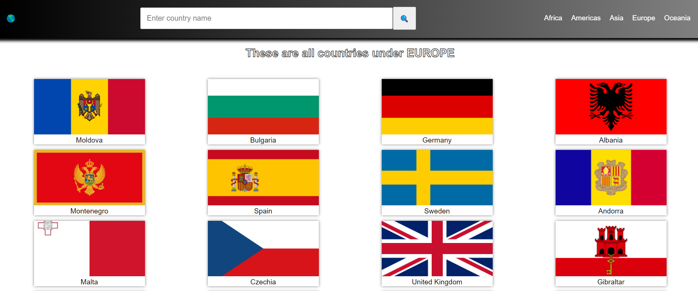
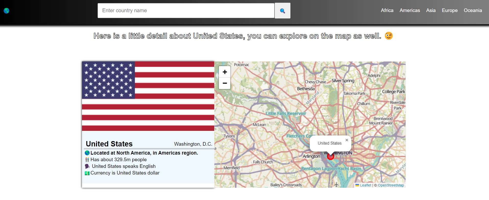

#  Get country data
After undergoing Jonas Schmedtmann's course, I built a personal project on asynchonous javascript, fetching country's data and also pinpointing the country on a map.

#  Deployed to 👇

Access - ([Project Link](https://emerald-country-data-fetch.netlify.app/))

### Features:
- Display country based on continent
- Display capital
- Display Region
- Display Language
- Display currency
- Display Population
- Display location on the map

### Built with

- Htnl
- Css
- Javascript
- Rest countries Api - ([API](https://restcountries.com/))
- Open street maps - ([API](http://www.openstreetmap.org/copyright/))

## My Social Media

- LinkedIn - [@emerald](https://www.linkedin.com/in/emmanuel-agimezelu-b1796320b/)
- Twitter - [@agiemerald](https://www.twitter.com/agiemerald)

#### All countries-list display👇

#### Country-data display👇

